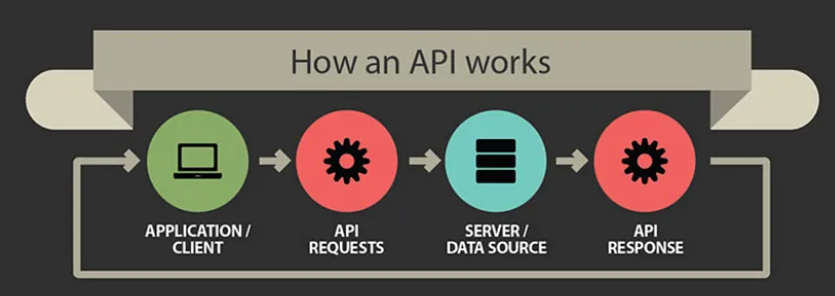
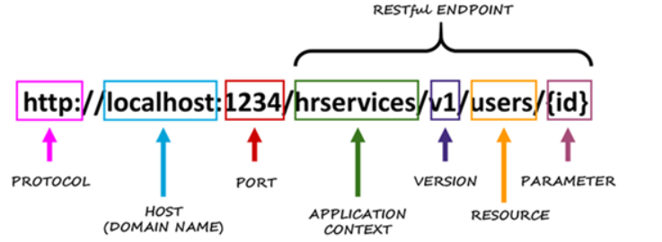
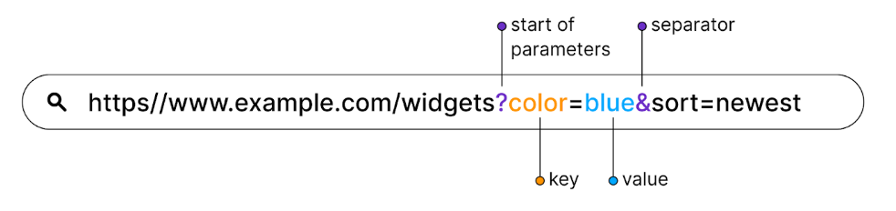
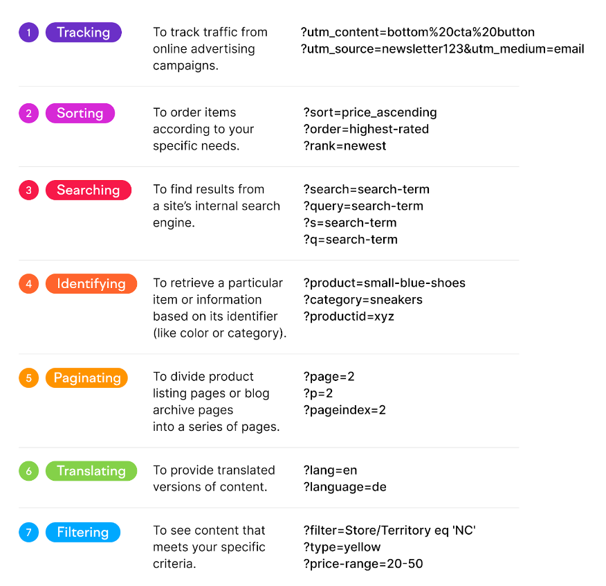

# API Essentials

-   API - Application Programming Interface. Interface between 1 piece of software to another.
-   Mostly use JSON language.
-   
-   API will call (request) a certain end-point, and receive information as response.
-   The endpoint will be defined as a url.

### API URLs

-   API url will be used as the endpoint to access the information.
-   
-   2 types of parameters:
    1. Path parameter
    2. Query parameter

#### Query Parameters

-   Set of key-value parameter attached at the end of url to filter out information.
-   Starts with '**?**'
-   For multiple queries use '**&**'
-   Example:
    -   
    -   1st parameter: **color**. 2nd parameter: **sort**.
-   Use cases of URL parameters::
    -   

### API Request Methods

1. **GET**: retrieve data
2. **POST**: send data
3. **PUT**: update data
4. **DELETE**: delete data
5. **PATCH**: partial update data
